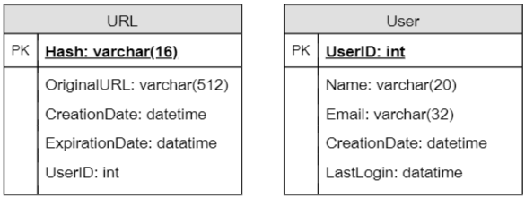
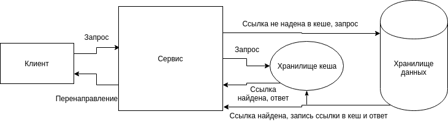

# Сервис коротких ссылок "_Название_"

## Описание Проблемы

Сокращение URL используется для создания более коротких псевдонимов для длинных URL. Также эти сокращенные псевдонимы называются «короткими ссылками». Пользователи перенаправляются на исходный URL-адрес при попадании на эти короткие ссылки. Короткие ссылки экономят много места при отображении, печати, обмене сообщениями или твиттинге. Кроме того, пользователи с меньшей вероятностью будут неправильно набирать короткие URL-адреса.

Пример
> Если мы укоротим ссылку на статью через сервис Tiny.cc:  
> https://developer.mozilla.org/en-US/docs/Web/API/Fetch_API/Using_Fetch  
> Мы получим: http://tiny.cc/p2904y

Сокращение URL-адресов используется для оптимизации ссылок на разных устройствах, отслеживания отдельных ссылок для анализа эффективности аудитории и кампании, а также для сокрытия связанных исходных URL-адресов.

## Требования сервиса

**Наша система сокращения URL должна соответствовать следующим требованиям:**

- Учитывая URL, сервис должен генерировать более короткий и уникальный псевдоним. Это называется короткой ссылкой.
- Когда пользователи получают доступ к короткой ссылке, сервис должен перенаправить их на исходную ссылку.
- При желании пользователи должны иметь возможность выбрать собственную короткую ссылку для своего URL.
- Срок действия ссылок истечет после стандартного промежутка времени по умолчанию. Пользователи должны иметь возможность указать срок действия.
- Перенаправление URL должно происходить с минимальной задержкой.
- Сервис должен поддерживать авторизацию пользователей
- Сервис должен предоставлять аналитические данные такие как: сколько раз происходило перенаправление, график перенаправлений по времени, используемые браузеры, местоположение пользователей и т.д.

## REST API системы

|Method|Path|Function|
|------|----|-------|
|POST|/createURL|Создание ссылки|
|GET|/{url_key}|Получение ссылки|
|DELETE|/{url_key}|Удаление ссылки|
TODO: написать нормальное в процессе

## Схемы баз данных

Одним из требований реализации проекта является использование трех различный СУБД.

### 1. MongoDB

Данные, которые мы будем хранить:

- Нам нужно хранить миллиарды записей.
- Каждый хранимый объект имеет небольшой размер (менее 1 КБ).
- Между записями нет никаких связей - кроме хранения информации, какой пользователь создал URL.
- Наш сервис предназначен для чтения.

**Схема базы данных**

Так как мы ожидаем сохранения миллиардов строк, и нам не нужно использовать отношения между объектами, лучше использовать хранилище ключей NoSQL. Таким образом, была выбрана СУБД MongoDB.  
TODO: расписать подробнее про монгу

### 2. Redis

> Redis (REmote DIctionary Server) — это нереляционная высокопроизводительная СУБД. Redis хранит все данные в памяти, доступ к данным осуществляется по ключу.

В данном сервисе Redis будет исользоваться как хранилище кэша и сессий.

**Хранилище кэша**  
В хранилище кэша будут храниться наиболее часто используемые в данный момент ссылки. Запрос будет осуществлен таким образом, что сначала сервис сначала будет искать ссылку в хранилище кэша. Если ссылка будет найдена, то приложение мгновенно перенаправит пользователя на исходную ссылку. Если ссылки в кэше не окажется, тогда приложение сделает запрос в основную базу данных (MongoDB), закеширует результат и перенаправит пользователя. По истечении определенного таймаута, если по ссылке никто не обращается, она удаляется из кеша.

**Хранилище сессии**  
В хранилище сессий хранятся сессии пользователей до тех пор, пока пользователь не выйдет из учетной записи или пока не истечет таймаут сессии.

TODO: подробнее расписать редис, редактировать диаграмму (добавить сессии), диаграмма данных...

### 3. ClickHouse

> ClickHouse - столбцовая система управления базами данных (СУБД) для онлайн обработки аналитических запросов (OLAP).

В данном сервисе ClickHouse будет использоваться для хранения аналитичских данных, а также запросов по ним для дальнейшего их отображения (для зарегистрированных пользователей).

TODO: схема...

## Базовый дизайн системы и алгоритм

### Cоздание короткого и уникального ключа для данного URL.

Ключ будет состоять из 6 символов. Для кодирования ключа будет использоваться кодировка base64. Используя эту, ключ длиной 6 букв даст 64 ^ 6 = ~ 68,7 миллиардов возможных строк.

Если несколько пользователей вводят один и тот же URL-адрес, они могут получить один и тот же сокращенный URL-адрес, что недопустимо. Поэтому ключ будет генерироваться случайным образом. Если он уже используется, генерируем новый ключ.

Поиск ключа происходит следующим образом. Ищем ключ в кэше или в хранилище. Если он присутствует, отправляем в браузер статус «HTTP 302 Redirect», передав сохраненный URL-адрес в поле «Location» запроса. Если этот ключ отсутствует, отправляется статус «HTTP 404 Not Found».

Сервис поддерживает пользовательские псевдонимы. Пользователи могут выбрать любой «ключ», который им нравится, но предоставление произвольного псевдонима не является обязательным. Пользователи могут указать максимум 16 символов на ключ клиента.